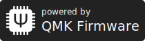

# Badges

A library to create badges in the style of "Google Play" and similar.

It's currently used in the API for my website (`GET https://api.sapuseven.com/badges/svg`)

## Installation

TODO

## Usage

```typescript
import badge from '@sapuseven/badges'

// All options besides `t` are optional
const options = {
    h: 60,              // height: px
    w: 210,             // width: px, omit to auto-fit text
    bg: '#222',         // background color: hex color code
    fg: '#fff',         // foreground color: hex color code
    t: 'QMK Firmware',  // mandatory: primary text
    t2: 'powered by',   // secondary text
    r: 8,               // corner radius: px
    ic: 'qmk',          // icon (see below for a list of available icons)
    icScale: 0.7,       // icon scale: fractional, 1.0 fits height, lower values produce paddings
}

console.log(badge(options))
```

Result:
<!-- all options: https://api.sapuseven.com/badges/svg?h=80&w=280&t=QMK%20Firmware&t2=powered%20by&r=8&ic=qmk&icScale=0.7 -->
<!-- omitting defaults: https://api.sapuseven.com/badges/svg?t=QMK%20Firmware&t2=powered%20by&ic=qmk -->


### Available Icons

<table>
  <tr>
    <td></td>
  </tr>
  <tr align="center">
    <td>qmk</td>
  </tr>
</table>
